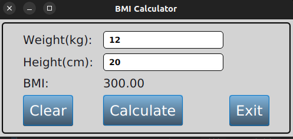
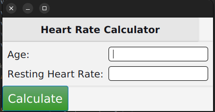
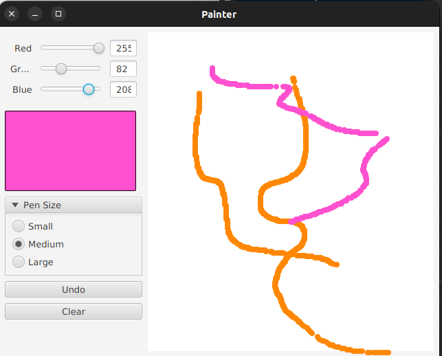
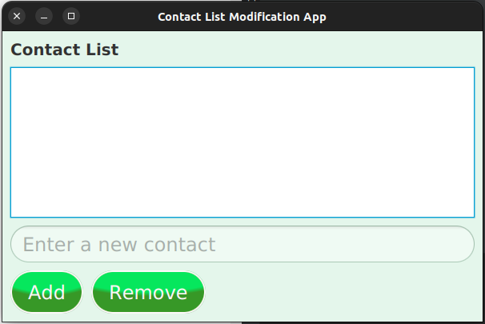
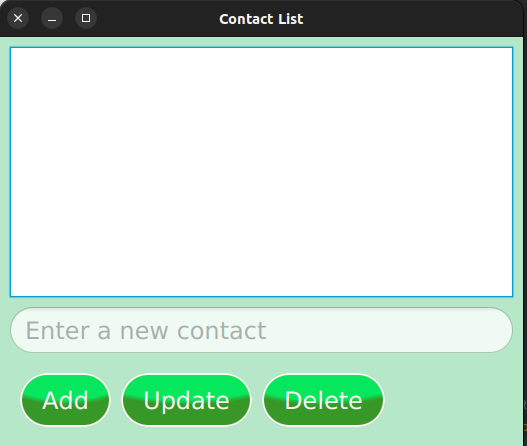
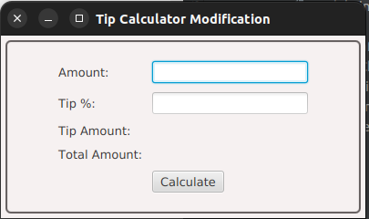
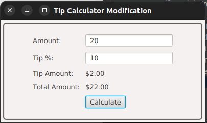
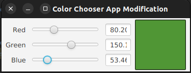

# <a href="https://github.com/Alibakhshov/JavaFX/tree/master/src/main/java/main/javafx">JavaFX Projects</a> 

## Table of Contents

<ol>
    <li><a href="#what-is-javafx">What is JavaFX?</a></li>
    <li><a href="#what-is-javafx-scene-builder">What is JavaFX Scene Builder?</a></li>
    <li><a href="#how-to-use-this-repository">How to use this repository?</a></li>
    <li>
        <a href="#projects-using-javafx-and-scene-builder">Projects using JavaFX and Scene Builder</a>
        <ul>
            <li><a href="#1-javafx-tip-calculator">Tip Calculator</a></li>
            <li><a href="#2-bmi-calculator">BMI Calculator</a></li>
            <li><a href="#color-picker">Color Picker</a></li>
            <li><a href="#file-chooser">File Chooser</a></li>
            <li><a href="#image-viewer">Image Viewer</a></li>
            <li><a href="#login-form">Login Form</a></li>
            <li><a href="#progress-bar">Progress Bar</a></li>
            <li><a href="#progress-indicator">Progress Indicator</a></li>
            <li><a href="#slider">Slider</a></li>
            <li><a href="#spinner">Spinner</a></li>
            <li><a href="#split-pane">Split Pane</a></li>
            <li><a href="#tab-pane">Tab Pane</a></li>
            <li><a href="#table-view">Table View</a></li>
            <li><a href="#text-area">Text Area</a></li>
            <li><a href="#text-field">Text Field</a></li>
            <li><a href="#toggle-button">Toggle Button</a></li>
            <li><a href="#tree-view">Tree View</a></li>
            <li><a href="#web-view">Web View</a></li>
        </ul>
    </li>
    

    <li><a href="#Acknowledgments">Acknowledgments</a></li>
    <li><a href="#Contact">Contact</a></li>
  </ol>


## What is JavaFX?

`JavaFX` is a software platform for creating and delivering desktop applications, as well as rich internet applications (RIAs) that can run across a wide variety of devices. JavaFX is intended to replace Swing as the standard GUI library for Java SE, but both will be included for the foreseeable future.

## What is JavaFX Scene Builder?

`JavaFX Scene Builder` is a visual layout tool that lets users quickly design JavaFX application user interfaces, without coding. It is a companion tool to the JavaFX SDK. JavaFX Scene Builder is an open source, free visual design tool for JavaFX applications, and is available under the GNU General Public License version 2 with the Classpath Exception.

## How to use JavaFX Scene Builder?

### 1. Download JavaFX Scene Builder

Download the latest version of JavaFX Scene Builder from [here](https://gluonhq.com/products/scene-builder/).

### 2. Install JavaFX Scene Builder

Extract the downloaded zip file and run the `SceneBuilder.exe` file.

### 3. Create a new project

Click on `File` and then `New` to create a new project.

### 4. Add a new FXML file

Click on `File` and then `New` to create a new FXML file.

### 5. Add a new controller class

Click on `File` and then `New` to create a new controller class.

### 6. Add a new FXML file to the project

Click on `File` and then `New` to create a new FXML file.

### 7. Add a new controller class to the project

Click on `File` and then `New` to create a new controller class.

## How to use this repository?

### 1. Clone the repository

Clone the repository using the following command:

```bash 
git clone "https://github.com/Alibakhshov/JavaFX.git"
```

### 2. Open the project in your IDE (preferably IntelliJ IDEA)

### 3. Run the project


## Projects using JavaFX and Scene Builder 

### 1. [JavaFX Tip Calculator](https://github.com/Alibakhshov/JavaFX/tree/master/src/main/java/main/javafx/TipCalculator)

Tip Calculator is a simple JavaFX application that calculates the tip for a given bill amount and tip percentage. 


***Output of the application:***


## 2. [BMI Calculator](https://github.com/Alibakhshov/JavaFX/tree/master/src/main/java/main/javafx/BMICalculator)
BMI Calculator is a simple JavaFX application that calculates the BMI of a person.

**Note:** Body Mass Index (BMI) is a person's weight in kilograms (or pounds) divided by the square of height in meters (or feet). BMI is used to determine whether a person is underweight, normal weight, overweight, or obese. 

***Output of the application:***



## 3. [Enhanced Tip Calculator](https://github.com/Alibakhshov/JavaFX/tree/master/src/main/java/main/javafx/EnhancedTipCalculator)
Enhanced Tip Calculator is a simple JavaFX application that calculates the tip for a given bill amount and tip percentage. It also calculates the total amount of the bill.

***Output of the application:***


## 4. [Target Heart Rate Calculator](https://github.com/Alibakhshov/JavaFX/tree/master/src/main/java/main/javafx/TargetHeartRateCalculator)
Target Heart Rate Calculator is a simple JavaFX application that calculates the target heart rate of a person. It uses the Karvonen formula to calculate the target heart rate. 

**Note:** The Karvonen formula is a method of calculating the target heart rate zone for a person. The formula is based on the maximum heart rate and resting heart rate of a person.

***Output of the application:***




## 5. [Painter](https://github.com/Alibakhshov/JavaFX/tree/master/src/main/java/main/javafx/PainterAppModification)
Painter is a simple JavaFX application that allows the user to draw shapes on a canvas. The user can choose the color and the size of the pen to draw. 
Navigate to the `FXML` source code <a href="https://github.com/Alibakhshov/JavaFX/tree/master/src/main/resources/main/javafx">here</a>.

***Output of the application:***




## 6. [Contact List App](https://github.com/Alibakhshov/JavaFX/tree/master/src/main/java/main/javafx/ContactListApp)
Contact List App is a simple JavaFX application that allows the user to add, edit, and delete contacts. The user can also search for a contact by name.

***Output of the application:***




## 7. [Contact List App Modification](https://github.com/Alibakhshov/JavaFX/tree/master/src/main/java/main/javafx/ContactsListAppModification)

Modified Contact List App is a simple JavaFX application that allows the user to add, edit and delete contacts.
Navigate to the source code here.

***Output of the application:***




## 8. [Modified Tip Calculator](https://github.com/Alibakhshov/JavaFX/tree/master/src/main/java/main/javafx/TipCalculatorModification)
Modified Tip Calculator is a simple JavaFX application that calculates the tip for a given bill amount and tip percentage.


***Output of the application:***





## 9. [Color Chooser](https://github.com/Alibakhshov/JavaFX/tree/master/src/main/java/main/javafx/ColorChooserAppModification)
Color Chooser is a simple JavaFX application that allows the user to choose a color from a color palette. The user can also choose the color using the RGB sliders.
Navigate to the `FXML` source code <a href="https://github.com/Alibakhshov/JavaFX/tree/master/src/main/resources/main/javafx">here</a>.

***Output of the application:***



## Contributions

Anyone can contribute to this repository. If you want to contribute, please follow the steps below:

1. Fork this repository
2. Clone the forked repository
3. Create a new branch
4. Make changes to the code
5. Commit the changes
6. Push the changes to the forked repository
7. Create a pull request
8. Wait for the pull request to be merged
9. Celebrate your contribution to this repository
10. Repeat steps 1-9

## Contact

Any questions or suggestions? Feel free to contact me at

<a href="https://www.linkedin.com/in/rauf-alibakhshov-6b5aa5210/">
    
</a>

<a href="https://open.spotify.com/playlist/7KmIUNWrK8wEHfQcQfFrQ1?si=0e2d44043b5a40a4">
    
</a>


