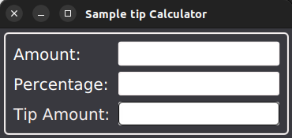
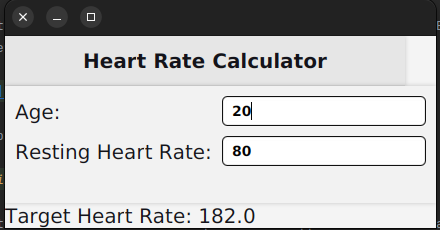

# JavaFX

Tip Calculator is a simple JavaFX application that calculates the tip for a given bill amount and tip percentage. The application is built using Java 8 and JavaFX 8. 
You can find the source code for this application here:

BMI Calculator is a simple JavaFX application that calculates the BMI of a person.
Click to view the source code.

Enhanced Tip Calculator

Target Heart Rate Calculator is a simple JavaFX application that calculates the target heart rate of a person. It uses the Karvonen formula to calculate the target heart rate. 
Navigate to the source code here.

