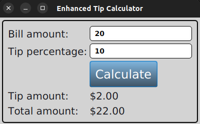

# JavaFX

Tip Calculator is a simple JavaFX application that calculates the tip for a given bill amount and tip percentage. The application is built using Java 8 and JavaFX 8. 
You can find the source code for this application here:

BMI Calculator is a simple JavaFX application that calculates the BMI of a person.
Click to view the source code.

Enhanced Tip Calculator

Target Heart Rate Calculator is a simple JavaFX application that calculates the target heart rate of a person. It uses the Karvonen formula to calculate the target heart rate. 
Navigate to the source code here.

Painter is a simple JavaFX application that allows the user to draw shapes on a canvas. The user can choose the color and the size of the pen to draw. 
Navigate to the source code here.

Output of the Painter application:

Contact List App is a simple JavaFX application that allows the user to add, edit and delete contacts.
Navigate to the source code here.

Output of the Contact List App:

